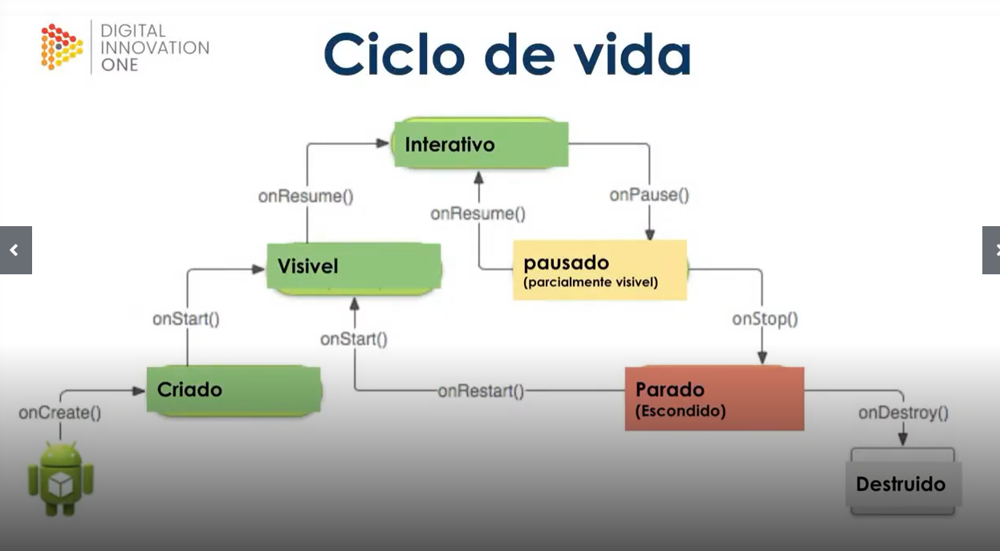

# Arquitetura

[Componentes, Layouts e UI/UX em apps android](https://github.com/TalitaRamos/Desafio-Santander-Bootcamp-Mobile-Developer/tree/main/Arquitetura/layout.md)

### AndroidManifest

Recebe informações essenciais para as ferramentas de compilação do Android, para o SO Android e para a Google Play.

Recebe a declaração de todas as activities, permissões do app,etc

### Ciclo de vida

Responsável por informar a criação, interrupção ou retomada de uma tela ou da destruição do processo pelo sistema

* onCreate: Momento em que a tela é criada mas ainda não é possível ver e nem interagir com nada. Ponto inicial do ciclo e só é chamado uma vez

* onStart: Desenha os componentes visualmente

* onResume: Aqui é o ponto onde o usuário já pode interagir com a tela. Enquanto o usuário está interagindo com a tela o estado é o onResume. O onResume é o ponto final do ciclo visível

* onPause: Quando o foco é perdido, ou seja,algo está sobrescrevendo a minha tela porém ela ainda está parcialmente visível. Se o usuário voltar para a tela o onResume é retomado

* onStop: Quando a tela não está visível, ou seja, minimizada. Se o usuário retornar ele passa pelo onRestart(voltando para redesenhar a tela como estava antes passando pelo onStart) 

* onRestart: Processo feito quando a tela estava minimizada e o usuário volta para ela. A tela será redesenhada pois não estava mais sendo exibida porém será redesenhada com base no estado anterior da tela passando pelo onStart.

* onDestroy: Final do ciclo. Quando o usuário decide sair de vez da aplicação

> Ciclo visível: Enquanto o usuário está com a aplicação aberta

> Ciclo invisível: Enquanto a aplicação está em segundo plano ou quando o usuário fecha o app

