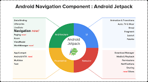

# Componentes, Layouts e UI/UX em apps android

## Android Jetpack

#### Introdução

Conjuntos de bibliotecas que encapsula uma série de boas práticas e componentes para reduzir códigos repetitivos



> Androidx : Substitui as antigas bibliotecas de suporte e faz a padronização dessas bibliotecas

> Core-ktx: Traz o core das dependências de extensão do kotlin 

> AppCompat : Biblioteca de compatibilidade para versões mais antigas da API do android

> ConstraintLayout : Uma das formas mais flexíveis para construir layouts

#### View Binding

Facilita/centraliza o acesso aos componentes definidos no XML

```
android {
    buildFeatures {
        viewBinding true
    }
}
```

#### SwipeRefreshLayout

Componente para fazer refresh de uma listagem de elementos

```
implementation 'androidx.swiperefreshlayout:swiperefreshlayout:1.1.0'
```

## Material Design

Sistema de design genérico que pode ser aplicado em diversas plataformas

Referências importantes:

* [Sistemas de cores](https://material.io/design/color/the-color-system.html#tools-for-picking-colors)
    * [Color Tool](https://material.io/resources/color/#!/?view.left=0&view.right=0)
    
* [Temas claro e escuro](https://material.io/design/color/dark-theme.html#ui-application)
    
* [Variações de "Top App Bars"](https://material.io/components/app-bars-top/android#regular-top-app-bar) 

> Alt + Enter: Extrair para resource
> Ctrl + r: Replace
## Layouts do App

## Glide

Gerenciador de mídia rápido e eficiente que abstrai o processo de carregamento de imagens em Android, gerenciando desde a decodificação e transformação até o controle do cache das mesmas

> implementation 'com.github.bumptech.glide:glide:4.11.0'

> annotationProcessor 'com.github.bumptech.glide:compiler:4.11.0'

## Retrofit

Cliente HTTP para Android e Java. Tem a função de abstrair a complexidade no consumo de APIs. Possui uma série de facilidades que facilita o consumo de recursos.

> implementation 'com.squareup.retrofit2:retrofit:2.9.0'

> implementation 'com.squareup.retrofit2:converter-gson:2.9.0'

## Parcelable

## Links

* [Documentação Android Jetpack](https://developer.android.com/jetpack?gclid=CjwKCAjwk_WVBhBZEiwAUHQCmejNWru4iWG4PrezVv7iarzW4OlPUx3W2hHDaEodcRbwVJ-8iGwv6xoC1VsQAvD_BwE&gclsrc=aw.ds)

* [Material.io](https://material.io/)


* [Android Open Source Project](https://source.android.com/)

* [Retrofit (HTTP Client)](https://square.github.io/retrofit)

* [Glide (Image Loading)](https://github.com/bumptech/glide)

* [Listar dinâmicas com Recycler View](https://developer.android.com/guide/topics/ui/layout/recyclerview?hl=pt-br)