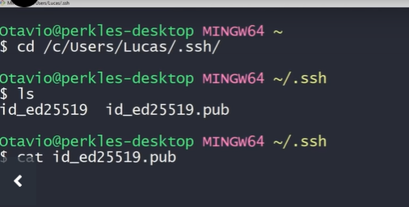

# Git

## SSH

#### 1 - Gerar par de chaves (pública e privada) no git bash

1. Digitar: **ssh-keygen -t ed25519 -C** email@gmail.com
2. Confirmar o local onde a chave vai ser salva
3. Adicionar uma senha e confirmar a senha
4. Chave gerada \o/
5. Pasta padrão onde as chaves estão : **C:\Users\SeuUser\\.ssh**

OBS: A chave gerada com .pub é a chave pública

#### 2 - Visualizar chave para copiar conteúdo

1. Na pasta que as chaves são armazenadas digite **cat nome_chave.pub**
2. Copie a chave

## Adicionar chave ao gitHub

1. Em settings → SSh and GPG keys escolha add new SSH, cole a chave e adicione um título
2. No git bash, na pasta que estão as chaves digite **eval $(ssh-agent -s)** .Esse comando inicializa o ssh agent (entidade que é encarregada de pegar as chaves e lidar com elas)
3. Entregar chave privada ao agente : *ssh-add nome_chave*
4.Digitar senha dada para a chave

## Token de acesso pessoal

1. Em settings vai para developer settings → Personal access tokens → new token
2. Pode escolher um tempo para expirar e marca a opção repo para usar as opções básicas e escolher um título
3. Clicar em generate token e copia o token para usar no git

## Comandos básicos

* **git init** : Inicializa o rastreamento em um diretório
* **git clone**: Clona um repositório existente a partir de um link
* **git add**: Adiciona novos arquivos no monitoramento do git
* **git status**: Retorna o status dos arquivos
* **git commit**: Armazena o conteúdo atual em um novo commit juntamente com uma mensagem
* **git branch**: Cria uma nova branch
* **git checkout**: Muda de branch
* **git pull**: Traz as alterações do repositório remoto para o repositório atual
* **git push**: Envia os commits do repositório local para o repositório remoto

## Links importantes

* [Guia do Git](https://comandosgit.github.io/#gitadd)
* [Guia do Markdown](https://www.markdownguide.org/getting-started/)
* [Instalar o Git no Windows](https://msysgit.github.com)
* [Site do GitHub](https://github.com/)