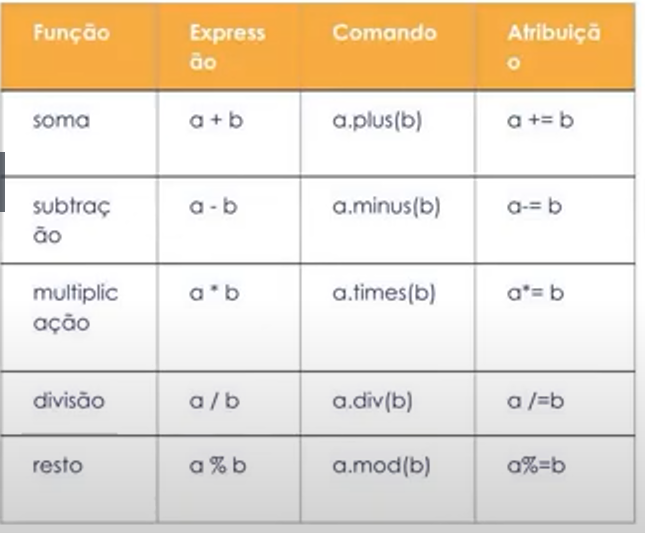
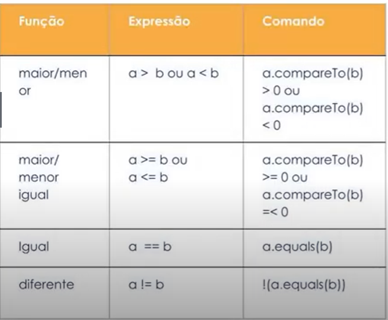
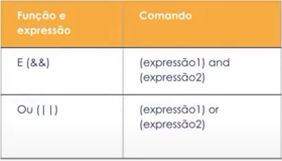
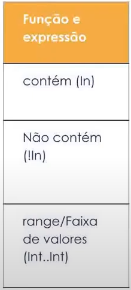
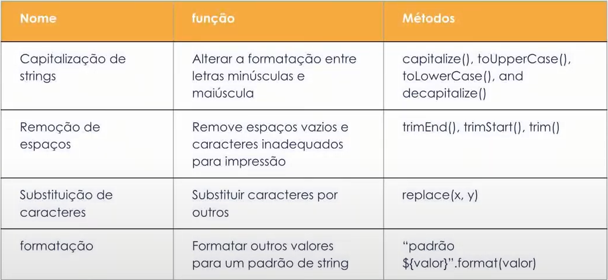

# Kotlin

## Introdução

#### O que é Kotlin

O kotlin é gratuito e de código aberto

Kotlin é o nome de uma ilha russa**

>**Foi lançado em 2016**

>**Em 2017 o Google anuncia suporte a Kotlin**

>**2018 foi a segunda linguagem preferida dos desenvolvedores**

>**2019 Google anuncia que o Kolin é a nova linguagem oficial para desenvolvimento Android, ou seja, Kotlin First**

#### Estrutura do Kotlin

* Não utiliza ponto e vírgula
* Não possui operador térnario tradicional - possui operador próprio
* Possui Type Safe e null safe
* Inferência de tipo

#### Vantagens

* É segura, estruturada, menos verbosa, mais otimizada, tem relevância no mercado

* O Kotlin roda juntamento com o java, ou seja, é possível migrar partes de um aplicação para o kotlin enquanto outra parte ainda roda com o java.

* Smart cast (antes da execução é possível garantir que o stipos estão atribuídos corretamente)

* Null safety

#### Desvantagens

* Perde um pouco de desempenho

## Sintáxe básica

#### Tipos de dado

* int
* Long
* Float
* Double
* Array
* List 
* ArrayList
* Boolean
* Char
* Byte
* Short
* Null

> Para saber o valor máximo que uma variável pode receber basta executar o código dessa forma: `println(Int.MAX_VALUE)`

Para converter dados para outro tipo basta chamar a função de conversão na variável. Ex: `toByte(), toInt(), toLong()`. Se a conversão não for possível é retornado um erro de compilação ou um alerta é exibido em tempo de escrita.

#### Declaração de variáveis

##### Prefixos:

> CamelCase: Inicia a variável com letra minuscúla e as outras palavras possuem a primeira letra  maiúscula

> SNAKE_CASE: Sempre em letras maiúsculas e palavras separadas pelo underline(_)

* **Var** (valor mutável, CamelCase) : Variávvel que pode ter seu valor alterado durante o código

```
var currentAge = 22 // variável assume o valor recebido na primeira atribuição

var currentAge:Int? // Variável declarada apenas como int

currentAge = null || 22
```

* **Val** (valor imutável, CamelCase): Variável terá o valor atribuído somente uma vez - similar ao final

```
var currentAge = 22 // O valor não pode ser alterado

var currentAge:Int?
currentAge = null || 22
```

* **Const Val** (valor imutável, SNAKE_CASE): constante cujo o valor é atribuído durante a compilação

```
const val MIN_AGE = 16
const val MAX_AGE = 68
```

#### Erros na declaração de variáveis

* Não é permitido atribuir um valor após a declaração da variável sem que antes o tipo seja especificado ou a variável seja inicializada na declaração

```
var current
    currentAge = 90
```

* Não é permitido atribuir um valor de um tipo difente do tipo inferido na declaração da variável

```
var currentYear = 'Ano'
    currentYear = 2022
```

#### Nullability

No Kotlin qualquer tipo pode ser nulo, porém, para deixar isso explícito deve ser feito o uso da `?` na declaração da variável.


```
var month:Int? = null // atribuição ocorre corretamente
var day:Int = null // Erro
```

#### Operadores aritméticos

No kotlin os operadores podem ser chamados tanto como expressões quanto como comandos.



#### Operadores comparativos

Utilizados para comparar valores.

Os operadores em expressões retornam booleanos.

Os operadores em comandos retornam valores -1(menor que), 0 (igual) e 1 (maior).



#### Operadores Lógicos

Utilizados quando é necessário usar duas ou mais condições dentro da mesma instrução



#### Operadores In e Range

Operadores específicos do Kotlin que impedem a criação de condicionais grandes e estruturas de repetição complicadas

* IN: Verifica se um valor ou uma faixa da velores está presente em uma lista 

* Range: Cria uma faixa de valores que inicia no primeiro parâmetro e acaba no segundo



```
   val bingo = listOf(8,6,34,2,13)
   val number = (1..34).random()
   
   println(number)
   println(number in bingo)
```

```
const val MIN_AGE = 16
const val MAX_AGE = 68

fun main() {
  var age = (18..100).random()
  println(age)
  println(age in MIN_AGE..MAX_AGE)
  println(age >= MIN_AGE && age <= MAX_AGE)
}
```

#### Manipulando Strings

##### Indexação

* Uma string também pode ser tratada como um array de Char e para isso existem alguns métodos específicos 

  * First(): Acessa a primeira posição do array
  * Last(): Acessa a última posição do array
  * String.lenght: Para saber o tamanho do array
  * String[index]: Acessar a posição específica do array
  
##### Concatenação

* Para concatenas duas strings o plus `+` pode ser utilizado

`println(s + name)`

* Para concatenar uma variável a uma String, os símbolos `${}` devem ser inseridos

`println("${s}, ${name}!")`

`println("Olá, $name!")`

```
  val welcome = "Bem vinda(o)"
  var name = "Talita"
    
  println("$welcome, ${name.capitalize()}"
```

##### Formatação

Funções utilizadas para formatas as strings



#### Diferença entre Empty e Blank

* Empty: Verifica se a string está vazia, ou seja, o tamanho dela é igual a zero

`val s = ""`

* blank: Verifica se a string está em branco

`val s = "    "`

OBS: Se uma string retorna true para `isEmpty` irá retornar true para `isBlank` pois da mesma forma não possui nenhum conteúdo significativo

* IsNullOrBlank: Verifica se é nulo ou branco

* IsNullOrEmpty: Verifica se é nulo ou vazio

#### Introdução a Funções

#### Funções de ordem superior

#### Funções single-line e Funções/extensões

#### Estruturas de Controle

#### Atribuições, When e Elvis Operator

#### Estruturas de Repetição

## Links

* [Documentação Android](https://developer.android.com/docs)

* [Documentação Kotlin](https://developer.android.com/kotlin)

* [Outra Documentação Kotlin](https://kotlinlang.org/)

* [Kotlin Playground](https://play.kotlinlang.org/)

* [KMM - Kotlin Mobile Multiplatform](https://kotlinlang.org/lp/mobile/)

* [Kotlin for javascript](https://kotlinlang.org/docs/js-overview.html)